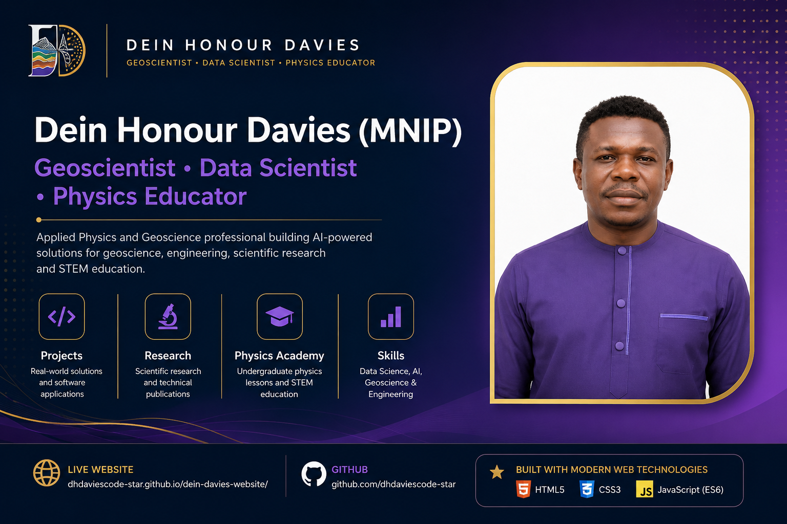

# Dein Honour Davies Portfolio Website




---

# 🌐 Live Website

👉 **https://dhdaviescode-star.github.io/dein-davies-website/**

---

# Overview

This repository contains the source code for my professional portfolio website.

The website serves as a central hub for my work in:

- Geoscience
- Data Science
- Artificial Intelligence
- Scientific Computing
- Reservoir Engineering
- Physics Education
- Software Development

It showcases my projects, research, publications, technical skills, and educational initiatives while serving as a practical demonstration of modern front-end web development.

---

# Project Goals

This website was developed to:

- Build a professional online presence
- Showcase research and engineering projects
- Publish educational resources
- Demonstrate front-end development skills
- Provide a platform for future scientific software projects
- Integrate research, teaching, and software engineering into one professional portfolio

---

# Features

✔ Fully Responsive Design

✔ Mobile Navigation

✔ Smooth Scrolling

✔ Active Navigation Highlighting

✔ Scroll Reveal Animations

✔ Back-to-Top Button

✔ Modern Hero Section

✔ Professional Project Cards

✔ Responsive CSS Grid Layout

✔ Professional Footer

✔ SEO Optimized

✔ Open Graph Integration

✔ Twitter Card Support

✔ robots.txt

✔ sitemap.xml

✔ Google Search Console Integration

✔ Google Analytics 4

✔ GitHub Pages Deployment

✔ Professional Branding

✔ Favicon Support

---

# Technologies Used

| Technology | Purpose |
|------------|---------|
| HTML5 | Website Structure |
| CSS3 | Styling & Layout |
| JavaScript (ES6) | Interactivity |
| Git | Version Control |
| GitHub | Source Code Hosting |
| GitHub Pages | Website Deployment |
| Google Search Console | Search Engine Indexing |
| Google Analytics 4 | Visitor Analytics |

---

# Folder Structure

```text
dein-davies-website/
│
├── assets/
│   ├── css/
│   │     └── style.css
│   │
│   ├── js/
│   │     └── script.js
│   │
│   ├── images/
│   │
│   └── icons/
│
├── index.html
├── 404.html
├── robots.txt
├── sitemap.xml
├── google6afbdadc95c4bd58.html
└── README.md
```

---

# Website Sections

- Hero
- What I Do
- Skills & Expertise
- Featured Projects
- Physics Academy
- Research
- Contact
- Footer

---

# Current Status

✅ Portfolio Website Complete

✅ Responsive Design

✅ Mobile Friendly

✅ Professional Deployment

✅ Search Engine Optimized

✅ Analytics Enabled

🚧 Continuously Improving

---

# Future Roadmap

- [ ] Dark Mode
- [ ] Physics Academy Expansion
- [ ] Research Publications Database
- [ ] GitHub API Integration
- [ ] Interactive Project Filtering
- [ ] Blog Platform
- [ ] Conference Presentations
- [ ] AI Projects Gallery
- [ ] Research Repository
- [ ] Contact Form Backend
- [ ] CMS Integration
- [ ] Performance Optimization

---

# Development Philosophy

This project is being developed incrementally following professional software engineering practices.

Each feature is designed, implemented, tested, documented, and deployed before moving to the next stage.

The goal is not only to build a portfolio website but also to create a maintainable, scalable, and production-ready codebase while documenting the learning journey from beginner to professional front-end development.

---

# Author

## Dein Honour Davies (MNIP)

**Geoscientist • Data Scientist • Physics Educator**

### Connect with me

🌐 Website

https://dhdaviescode-star.github.io/dein-davies-website/

GitHub

https://github.com/dhdaviescode-star

LinkedIn

https://www.linkedin.com/in/dein-davies-522490412/

---

# License

This project is licensed under the MIT License.

Feel free to explore the code for educational purposes.

---

## Acknowledgements

This project is part of a structured web development learning journey focused on mastering HTML, CSS, JavaScript, Git, GitHub, deployment, SEO, accessibility, and modern front-end development through project-based learning and continuous improvement.